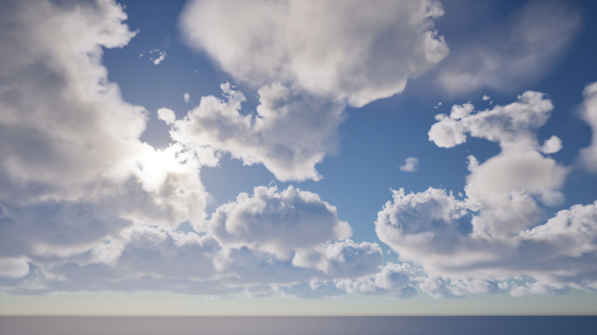

# Modeling Volumetric Clouds

Master's [dissertation](https://drive.google.com/file/d/1FEx7_ofGtQCDe-PSPsKEA2OZYG4zqg3g/view?usp=sharing) in Computer Graphics, entitled: Modeling Volumetric Clouds.

A shader ([material graph](MaterialGraph/) in UE 5.3.2) was developed to model clouds:

- Two different noise layers were modeled: one for the base shape of the clouds (using a volume texture consisting of Perlin-Worley noise, from the UE Volumetrics Plugin) and one for the erosion details (using a volume texture consisting of Curly-Alligator noise, introduced in [Schneider, 2023](https://advances.realtimerendering.com/s2023/index.html#Nubis3));
- The vertical density gradient is modeled using two 2D textures (following the methods to create the *Vertical Profile*, as in [Schneider, 2023](https://advances.realtimerendering.com/s2023/index.html#Nubis3)). The gradient textures that were used, are the [T_DensityGradient.tiff](DensityGradient/textures/T_DensityGradient.tiff) (this had to be done by hand, using the other three gradients as interval references) and the [T_Bottom_DensityGradient.tiff](DensityGradient/textures/T_Bottom_DensityGradient.tiff);
- This solution analytically computes the cloud coverage component in three different ways, with no need of sampling a 2D weather texture;
- Several user parameters were defined to control all the different components;
- Cloud animation is simple pseudo-motion;
- Developed as a [plugin](PG47702_VClouds/Plugins/).

The template project has all the examples present in the results section of the [dissertation](https://drive.google.com/file/d/1FEx7_ofGtQCDe-PSPsKEA2OZYG4zqg3g/view?usp=sharing) (using Material Instances).
The [dissertation](https://drive.google.com/file/d/1FEx7_ofGtQCDe-PSPsKEA2OZYG4zqg3g/view?usp=sharing) shall be used for any needed documentation.

The example results were rendered with the [HG+D](PhaseFunctionSampling/hg_d.hlsl) model, with *d = 12.0* (the *PhaseBlend* variable).

###### Tiago Gomes | [PG47702](mailto:pg47702@alunos.uminho.pt) - University of Minho | Email: [tiagotg778@gmail.com](mailto:tiagotg778@gmail.com)

---
## Example of cumulus clouds

---
## Example of stratus and stratocumulus clouds

---
## Example of cirrus clouds

---
## Example of asperitas-inspired clouds

The dynamics of the asperitas cloud movements are not simulated.

